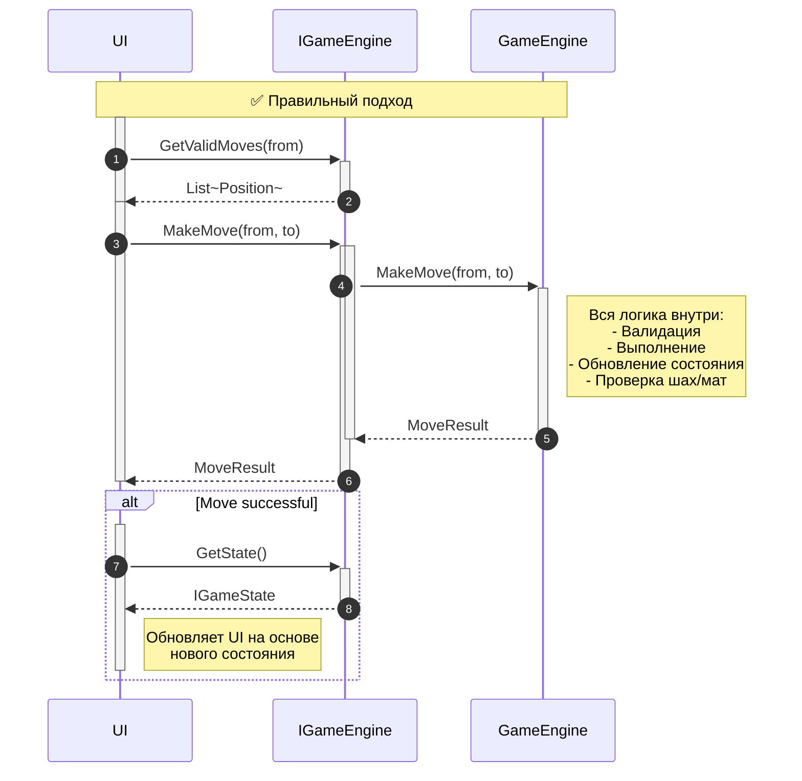
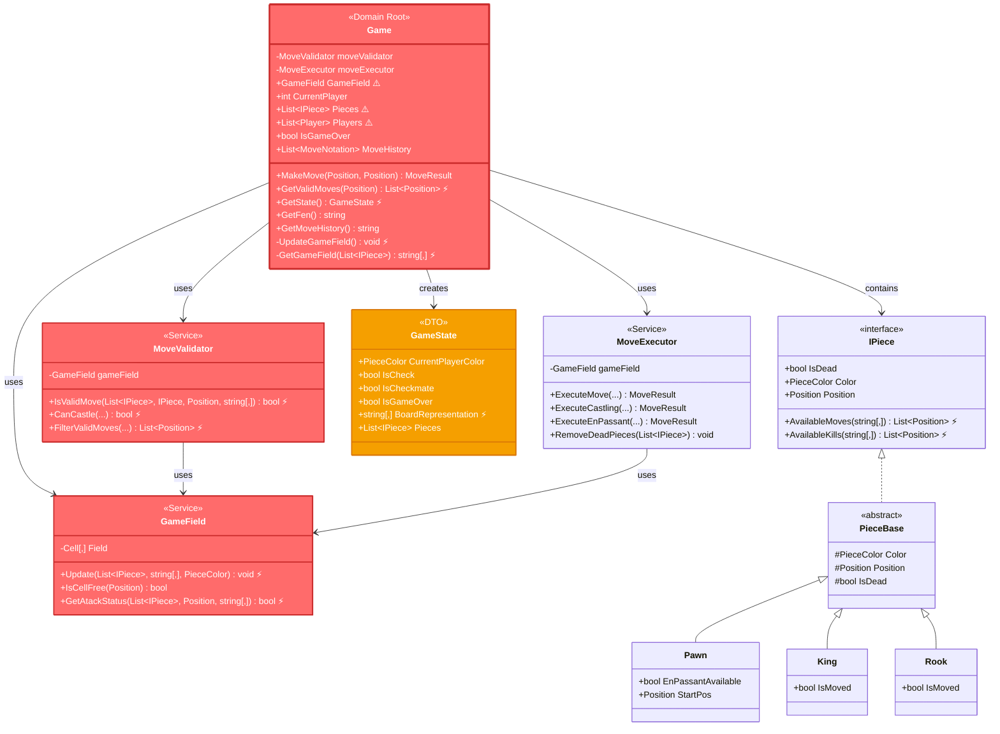
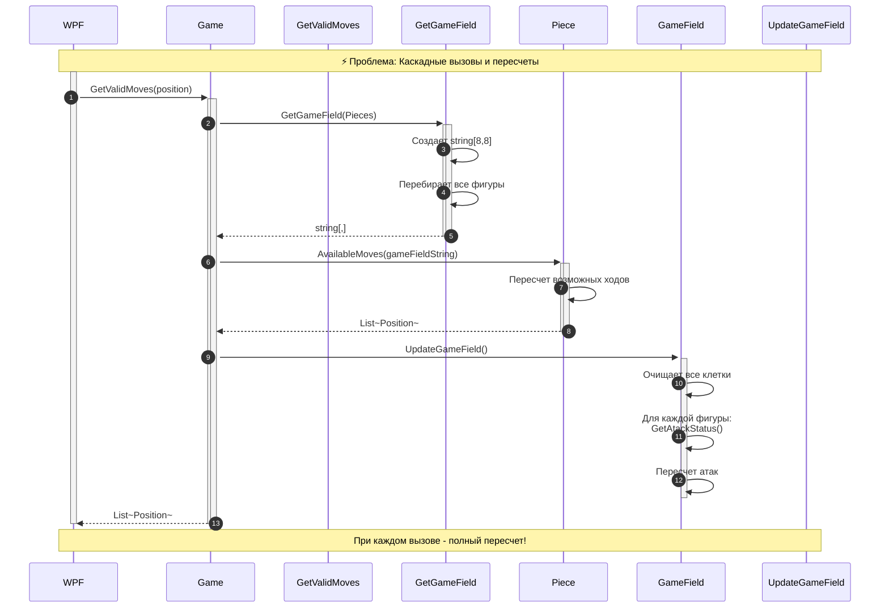
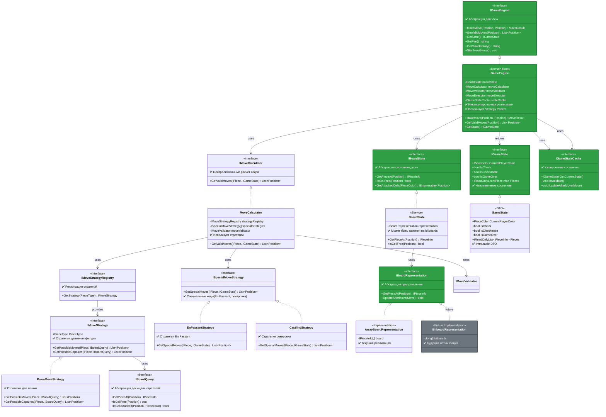
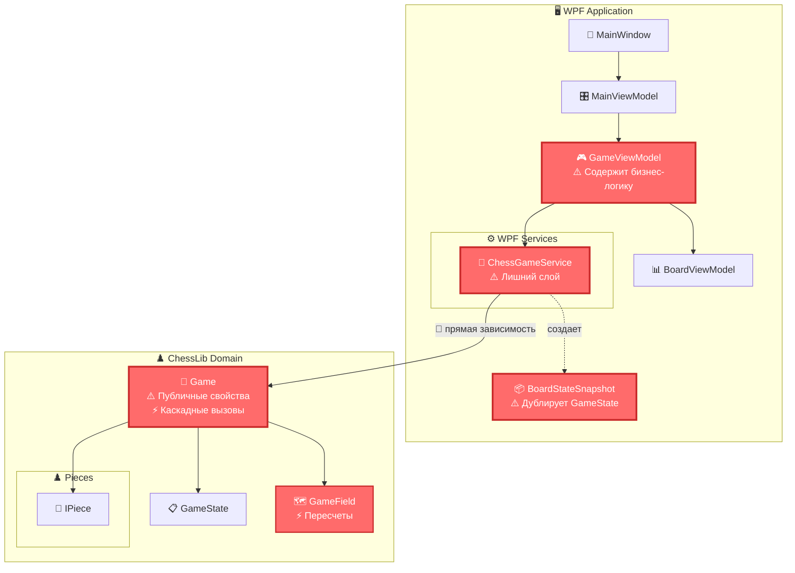
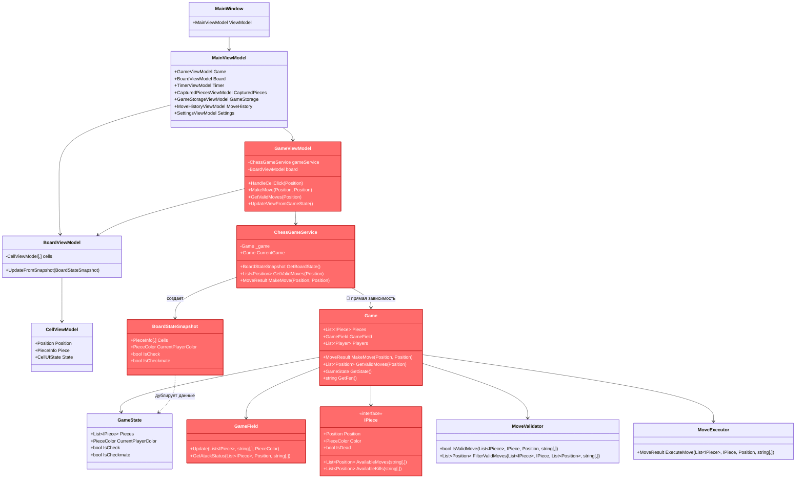
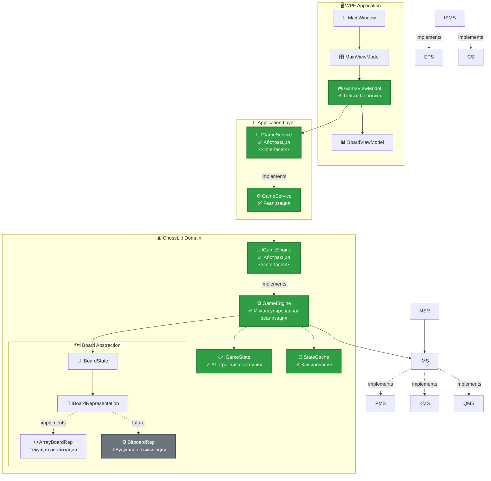

# Анализ архитектурных проблем Chess Application

> 📋 **Документ содержит анализ текущей архитектуры, выявленные проблемы и план рефакторинга с приоритетом на библиотеку**

---

## 📑 Оглавление

1. [📊 Легенда диаграмм](#-легенда-диаграмм)
2. [🎯 Стратегия рефакторинга](#-стратегия-рефакторинга)
3. [✅ Правильный API библиотеки](#-правильный-api-библиотеки-принципы-проектирования)
   - [🎯 Основные принципы](#-основные-принципы)
   - [📐 Предлагаемый API](#-предлагаемый-api)
   - [🔄 Типичный поток работы](#-типичный-поток-работы)
   - [💡 Что возвращать в состоянии?](#-что-возвращать-в-состоянии)
4. [🔍 Выявленные проблемы](#-выявленные-проблемы)
   - [1. ⚡ Каскадные вызовы и пересчеты](#1--каскадные-вызовы-и-пересчеты-в-библиотеке)
   - [2. 🔴 Нарушение инкапсуляции в Game](#2--нарушение-инкапсуляции-в-game)
   - [3. 🔴 Отсутствие абстракции для взаимодействия](#3--отсутствие-абстракции-для-взаимодействия)
   - [4. ⚠️ Дублирование моделей состояния](#4--дублирование-моделей-состояния)
   - [5. ⚠️ Смешение ответственности в GameViewModel](#5--смешение-ответственности-в-gameviewmodel)
   - [6. 🔴 Восстановление игры реализовано в обход библиотеки](#6--восстановление-игры-реализовано-в-обход-библиотеки)
   - [7. 🔴 Проблемы реализации фигур и каскадные вызовы](#7--проблемы-реализации-фигур-и-каскадные-вызовы)
   - [8. 🔴 Дублирование логики получения доступных ходов и En Passant](#8--дублирование-логики-получения-доступных-ходов-и-en-passant)
   - [9. ℹ️ IView - существующий компонент](#9--iview---существующий-компонент-не-проблема)
5. [📐 Подробный анализ библиотеки ChessLib](#-подробный-анализ-библиотеки-chesslib)
   - [Текущая структура библиотеки](#текущая-структура-библиотеки)
   - [Проблемы производительности](#проблемы-производительности)
   - [Предлагаемая структура библиотеки](#предлагаемая-структура-библиотеки)
   - [Улучшенная последовательность (с кэшированием)](#улучшенная-последовательность-с-кэшированием)
6. [🏗️ Текущая архитектура (WPF ↔ Library)](#️-текущая-архитектура-wpf--library)
7. [📐 Полные диаграммы архитектуры (уровень классов)](#-полные-диаграммы-архитектуры-уровень-классов)
   - [🔴 Текущая архитектура (WPF ↔ ChessLib)](#-текущая-архитектура-wpf--chesslib)
   - [✅ Исправленная архитектура (WPF ↔ ChessLib)](#-исправленная-архитектура-wpf--chesslib)
   - [🔄 Сравнение взаимодействий](#-сравнение-взаимодействий)
8. [✨ Предлагаемая архитектура](#-предлагаемая-архитектура)
9. [📋 Поэтапный план рефакторинга](#-поэтапный-план-рефакторинга)
   - [🎯 Общая стратегия](#-общая-стратегия)
   - [📍 Этап 1: Подготовка и инфраструктура](#-этап-1-подготовка-и-инфраструктура)
   - [📍 Этап 2: Создание абстракций в библиотеке](#-этап-2-создание-абстракций-в-библиотеке)
   - [📍 Этап 3: Рефакторинг Game → GameEngine с CQRS + Strategy Pattern](#-этап-3-рефакторинг-game--gameengine-с-cqrs--strategy-pattern)
   - [📍 Этап 4: Устранение дублирования логики ходов](#-этап-4-устранение-дублирования-логики-ходов-и-en-passant)
   - [📍 Этап 5: Добавление методов восстановления игры](#-этап-5-добавление-методов-восстановления-игры-в-библиотеку)
   - [📍 Этап 6: Абстракция BoardState](#-этап-6-абстракция-boardstate)
   - [📍 Этап 7: Создание IGameService в Application слое](#-этап-7-создание-igameservice-в-application-слое)
   - [📍 Этап 8: Миграция WPF на IGameService](#-этап-8-миграция-wpf-на-igameservice)
   - [📍 Этап 9: Удаление устаревшего кода](#-этап-9-удаление-устаревшего-кода)
   - [📍 Этап 10: Финальная проверка и документация](#-этап-10-финальная-проверка-и-документация)
10. [📊 Сводная таблица этапов](#-сводная-таблица-этапов)
11. [🎯 Преимущества предлагаемой архитектуры](#-преимущества-предлагаемой-архитектуры)
12. [🔮 Будущие оптимизации (не сейчас)](#-будущие-оптимизации-не-сейчас)
    - [Bitboards](#bitboards)
13. [⚠️ Важные замечания](#️-важные-замечания)
    - [Принципы рефакторинга](#принципы-рефакторинга)
    - [Перед началом](#перед-началом)
    - [Во время рефакторинга](#во-время-рефакторинга)
    - [После рефакторинга](#после-рефакторинга)

---

## 📊 Легенда диаграмм

### Цветовая схема

| Цвет | Значение |
|------|----------|
| 🔴 **Красный** | Проблемные компоненты (нарушения принципов, производительность) |
| 🟡 **Желтый** | Компоненты требующие внимания |
| 🟢 **Зеленый** | Правильные решения (интерфейсы, абстракции) |
| 🔵 **Синий** | WPF слой (Presentation) |
| 🟠 **Оранжевый** | Domain слой (ChessLib) |
| 🟢 **Светло-зеленый** | Console приложение |
| ⚪ **Серый** | Существующие компоненты (не критично) |

### Символы

- ⚠️ — Проблема или предупреждение
- ✅ — Правильное решение
- 🔴 — Прямая зависимость (проблема)
- ⚡ — Проблема производительности
- 🔄 — Каскадные вызовы

---

## 🎯 Стратегия рефакторинга

### Приоритеты

1. **🔴 Критический**: Рефакторинг библиотеки (ChessLib)
   - Устранение каскадных вызовов
   - Улучшение инкапсуляции
   - Подготовка к будущим оптимизациям (bitboards)

2. **🟡 Высокий**: Абстракция взаимодействия View ↔ Library
   - Создание `IGameService`
   - Убрать прямые зависимости WPF от ChessLib

3. **🟢 Средний**: Упрощение WPF слоя
   - Убрать `BoardStateSnapshot`
   - Вынести бизнес-логику из ViewModels

### Цель

**Сделать так, чтобы при будущих оптимизациях библиотеки (bitboards, кэширование и т.д.) WPF приложение не требовало изменений.**

---

## ✅ Правильный API библиотеки (принципы проектирования)

### 🎯 Основные принципы

**Вы абсолютно правы!** Библиотека должна работать следующим образом:

1. **Входные данные**: Только `from` и `to` позиции
   - Библиотека не должна знать про UI события, клики мыши и т.д.
   - Простой, понятный интерфейс: `MakeMove(Position from, Position to)`

2. **Вся логика внутри библиотеки**:
   - Валидация хода
   - Выполнение хода
   - Обновление состояния игры
   - Проверка на шах/мат
   - Смена игрока
   - Вся игровая логика инкапсулирована

3. **Возвращаемое значение**:
   - `MoveResult` - результат попытки хода (успех/ошибка, тип хода, шах/мат)
   - `IGameState` - состояние игры (можно получить отдельным вызовом `GetState()`)

### 📐 Предлагаемый API

```csharp
public interface IGameEngine
{
    // Основной метод - выполнение хода
    MoveResult MakeMove(Position from, Position to);
    
    // Получение состояния игры
    IGameState GetState();
    
    // Вспомогательные методы для UI
    IReadOnlyList<Position> GetValidMoves(Position from);
    string GetFen();
    string GetMoveHistory();
    
    // Управление игрой
    void StartNewGame();
    void EndGameByTime(PieceColor losingColor);
}
```

### 🔄 Типичный поток работы



### 💡 Что возвращать в состоянии?

**Вариант 1: Полное состояние (рекомендуется для начала)**
```csharp
public interface IGameState
{
    PieceColor CurrentPlayerColor { get; }
    bool IsCheck { get; }
    bool IsCheckmate { get; }
    bool IsGameOver { get; }
    IReadOnlyList<IPieceInfo> Pieces { get; } // Все фигуры на доске
}
```

**Преимущества**:
- ✅ Простота использования
- ✅ UI всегда имеет актуальное состояние
- ✅ Легко реализовать

**Недостатки**:
- ⚠️ Может быть избыточно (если изменилась только одна фигура)

**Вариант 2: Только изменения (для оптимизации в будущем)**
```csharp
public interface IMoveResult
{
    bool IsValid { get; }
    MoveType MoveType { get; }
    PositionChanged[] ChangedPositions { get; } // Только изменения
    bool IsCheck { get; }
    bool IsCheckmate { get; }
}
```

**Преимущества**:
- ✅ Эффективнее (меньше данных)
- ✅ UI обновляет только изменившиеся клетки

**Недостатки**:
- ⚠️ Сложнее реализовать
- ⚠️ UI должен хранить предыдущее состояние

### 🎯 Рекомендация

**Для начала**: Возвращать полное состояние через `GetState()`

**В будущем**: Можно оптимизировать, добавив метод `GetStateChanges()` который возвращает только изменения, но это не должно ломать существующий код.

**Важно**: UI не должен знать про внутренности библиотеки. Он получает:
- `MoveResult` - результат хода
- `IGameState` - состояние игры
- `IReadOnlyList<Position>` - валидные ходы

Всё остальное (валидация, выполнение, обновление) - внутри библиотеки!

---

## 🔍 Выявленные проблемы

### 1. ⚡ **Каскадные вызовы и пересчеты в библиотеке**

**Проблема**: При каждом обращении к состоянию игры происходит полный пересчет доски

**Детали**:
- `GetState()` вызывает `GetGameField()` → создает новый `string[8,8]` каждый раз
- `UpdateGameField()` вызывается часто и пересчитывает атаки для всех фигур
- `GetValidMoves()` для каждой фигуры пересчитывает всю доску
- При старте игры для каждой фигуры пересчитывается состояние доски

**Последствия**:
- ⚡ Низкая производительность
- ⚡ Избыточные вычисления
- 🔴 Сложность оптимизации (все связано)

**Пример проблемы**:
```csharp
// В GetValidMoves для каждой фигуры:
var gameFieldString = GetGameField(Pieces); // Пересоздается массив
var possibleMoves = piece.AvailableMoves(gameFieldString); // Пересчет
```

### 2. 🔴 **Нарушение инкапсуляции в Game**

**Проблема**: Публичные свойства и методы дают прямой доступ к внутренним структурам

**Детали**:
- `public List<IPiece> Pieces` - прямой доступ к списку фигур
- `public GameField GameField` - прямой доступ к внутреннему представлению
- `public List<Player> Players` - внутренняя структура видна снаружи

**Последствия**:
- 🔴 Невозможность изменить внутреннюю реализацию (например, на bitboards)
- 🔴 WPF знает о внутренностях библиотеки
- 🔴 Сложность рефакторинга

### 3. 🔴 **Отсутствие абстракции для взаимодействия**

**Проблема**: WPF напрямую зависит от `Game` и внутренних структур

**Детали**:
- WPF использует `ChessGameService`, который оборачивает `Game`
- Но нет интерфейса `IGameService`
- WPF знает про `IPiece`, `Position`, внутренние структуры

**Последствия**:
- 🔴 Тесная связанность
- 🔴 При изменении библиотеки нужно менять WPF
- 🔴 Невозможность мокирования для тестов

### 4. ⚠️ **Дублирование моделей состояния**

**Проблема**: WPF создает `BoardStateSnapshot`, который дублирует `GameState`

**Последствия**:
- 🔴 Дополнительный слой преобразования
- 🔴 Риск рассинхронизации
- 🔴 Увеличение сложности

### 5. ⚠️ **Смешение ответственности в GameViewModel**

**Проблема**: `GameViewModel` содержит бизнес-логику

**Последствия**:
- 🔴 Нарушение SRP
- 🔴 Сложность тестирования

### 6. 🔴 **Восстановление игры реализовано в обход библиотеки**

**Проблема**: Логика восстановления игры находится в WPF слое и использует прямой доступ к внутренностям библиотеки

**Текущая реализация**:
1. **Парсинг PGN в WPF** (`PgnService.ParsePgnMoves`)
   - Извлекает список ходов в алгебраической нотации: `["e4", "e5", "Nf3", ...]`

2. **Восстановление через переигрывание** (`MoveHistoryViewModel.NavigateToMove`)
   ```csharp
   gameService.StartNewGame(); // Новая игра
   for (int i = 0; i <= moveIndex; i++)
   {
       var moveInfo = PgnMoveParser.ParseMove(moveNotation, gameService.CurrentGame);
       gameService.MakeMove(moveInfo.From, moveInfo.To); // Переигрываем каждый ход
   }
   ```

3. **Парсинг алгебраической нотации в WPF** (`PgnMoveParser`)
   - Использует `game.Pieces`, `game.CurrentPlayerColor`, `game.GetValidMoves`
   - Прямой доступ к внутренностям `Game`

**Последствия**:
- 🔴 Логика парсинга PGN в WPF слое - бэкенд не сможет использовать
- 🔴 Прямой доступ к `Game.Pieces` - нарушение инкапсуляции
- ⚡ Неэффективность - для восстановления на ходу N нужно переиграть все N ходов
- 🔴 Дублирование - парсинг разбросан между `PgnService` и `PgnMoveParser`
- 🔴 Невозможность быстрого восстановления из БД (нужно переигрывать все ходы)

**Решение**: Перенести логику восстановления в библиотеку:
```csharp
// В библиотеке
public interface IGameEngine
{
    // Восстановление из PGN
    void LoadFromPgn(string pgn);
    void LoadFromMoves(IEnumerable<string> moves);
    
    // Восстановление из FEN (быстрее!)
    void LoadFromFen(string fen);
    
    // Восстановление из состояния (самый быстрый - для БД)
    void LoadFromState(IGameState state);
    
    // Сериализация для сохранения в БД
    string SerializeState();
    IGameState GetState();
}
```

**Важно для бэкенда**: Бэкенд должен иметь возможность быстро восстановить игру из БД без переигрывания всех ходов.

### 7. 🔴 **Проблемы реализации фигур и каскадные вызовы**

**Проблема**: Фигуры работают с низкоуровневым представлением доски и вызываются каскадно при каждом запросе

**Текущая реализация**:

1. **Прямая зависимость от `string[,]`**
   ```csharp
   public abstract List<Position> AvailableMoves(string[,] GameField);
   public abstract List<Position> AvailableKills(string[,] GameField);
   ```
   - Все фигуры работают с массивом строк
   - Нет абстракции - сложно оптимизировать
   - Нужно пересоздавать массив каждый раз

2. **Каскадные вызовы** (подтверждено в коде)
   ```csharp
   // PieceBase.cs:20
   // there is a cascade calls 198 times per one piece, needs to be refactored
   ```
   - При каждом `GetValidMoves()` вызывается `GetGameField()` → создается `string[8,8]`
   - Затем для каждой фигуры вызывается `AvailableMoves()` и `AvailableKills()`
   - При старте игры для каждой фигуры пересчитывается состояние доски

3. **Смешивание команд и запросов**
   - `GetValidMoves()` (запрос) вызывает `AvailableMoves()` (запрос)
   - `MakeMove()` (команда) вызывает `GetValidMoves()` (запрос) → каскад
   - Нет разделения - команды вызывают запросы, что создает каскады

4. **Нет кэширования**
   - Каждый вызов пересчитывает все заново
   - Нет инвалидации кэша при изменении состояния

5. **Нарушение инкапсуляции**
   - `King.ShortCastling()` принимает `GameField` и `List<IPiece>` напрямую
   - Фигуры знают про внутреннюю структуру доски

**Последствия**:
- ⚡ **Производительность**: 198+ вызовов на одну фигуру при старте игры
- 🔴 **Масштабируемость**: Сложно оптимизировать (bitboards, кэширование)
- 🔴 **Тестируемость**: Сложно тестировать фигуры изолированно
- 🔴 **Гибкость**: Невозможно заменить представление доски без изменения всех фигур

**Решение: CQRS (Command Query Responsibility Segregation) + Абстракции**

1. **Разделить команды и запросы**
   ```csharp
   // Команды (изменяют состояние)
   public interface IGameCommand
   {
       MoveResult Execute(IGameState state);
   }
   
   // Запросы (читают состояние, не изменяют)
   public interface IGameQuery
   {
       List<Position> GetValidMoves(Position from, IGameState state);
       IGameState GetState();
   }
   ```

2. **Strategy Pattern для ходов фигур**
   ```csharp
   // Стратегия движения для каждой фигуры
   public interface IMoveStrategy
   {
       PieceType PieceType { get; }
       List<Position> GetPossibleMoves(IPiece piece, IBoardQuery board);
       List<Position> GetPossibleCaptures(IPiece piece, IBoardQuery board);
   }
   
   // Реализации для каждой фигуры
   public class PawnMoveStrategy : IMoveStrategy { }
   public class KingMoveStrategy : IMoveStrategy { }
   public class QueenMoveStrategy : IMoveStrategy { }
   public class RookMoveStrategy : IMoveStrategy { }
   public class BishopMoveStrategy : IMoveStrategy { }
   public class KnightMoveStrategy : IMoveStrategy { }
   
   // Абстракция доски
   public interface IBoardQuery
   {
       IPieceInfo GetPieceAt(Position position);
       bool IsCellFree(Position position);
       bool IsCellAttacked(Position position, PieceColor byColor);
   }
   
   // Фигуры используют стратегии
   public interface IPiece
   {
       PieceType Type { get; }
       PieceColor Color { get; }
       Position Position { get; }
       bool IsDead { get; }
       // Убрать методы AvailableMoves/AvailableKills
   }
   
   // Регистрация стратегий
   public interface IMoveStrategyRegistry
   {
       IMoveStrategy GetStrategy(PieceType pieceType);
   }
   ```

3. **Кэширование запросов**
   ```csharp
   public class GameStateCache
   {
       private IGameState _cachedState;
       private Dictionary<Position, List<Position>> _cachedValidMoves;
       
       public List<Position> GetValidMoves(Position from)
       {
           if (_cachedValidMoves.ContainsKey(from))
               return _cachedValidMoves[from];
           
           // Вычислить и закэшировать
           var moves = CalculateValidMoves(from);
           _cachedValidMoves[from] = moves;
           return moves;
       }
       
       public void Invalidate() // Вызывается после команды
       {
           _cachedState = null;
           _cachedValidMoves.Clear();
       }
   }
   ```

4. **Разделение ответственности**
   - **Команды** (`MakeMove`) → изменяют состояние → инвалидируют кэш
   - **Запросы** (`GetValidMoves`) → читают из кэша → не изменяют состояние

**Преимущества CQRS + Strategy Pattern**:
- ✅ Устранение каскадных вызовов - запросы кэшируются
- ✅ Производительность - вычисления только при изменении состояния
- ✅ Гибкость - можно заменить представление доски (bitboards)
- ✅ Тестируемость - стратегии тестируются изолированно
- ✅ Расширяемость - легко добавить новые стратегии или варианты правил
- ✅ Разделение ответственности - фигуры хранят состояние, стратегии - логику движения

### 8. 🔴 **Дублирование логики получения доступных ходов и En Passant**

**Проблема**: Логика получения доступных ходов и проверки En Passant дублируется в множестве мест

**Дублирование получения ходов**:

1. **`GetValidMoves()` в Game.cs** (строки 366-368)
   ```csharp
   var possibleMoves = piece.AvailableMoves(gameFieldString);
   var possibleKills = piece.AvailableKills(gameFieldString);
   ```

2. **`IsValidMove()` в MoveValidator.cs** (строки 33-35)
   ```csharp
   var possibleMoves = piece.AvailableMoves(gameFieldString);
   var possibleKills = piece.AvailableKills(gameFieldString);
   ```

3. **`IsCheckmate()` в Game.cs** (строки 464-466)
   ```csharp
   var possibleMoves = piece.AvailableMoves(gameFieldString);
   var possibleKills = piece.AvailableKills(gameFieldString);
   ```

**Дублирование En Passant**:

1. **`GetValidMoves()` для пешки** (Game.cs:379-408)
   - Фильтрует все фигуры для поиска вражеских пешек
   - Проверяет позиции (Y == 4 для белых, Y == 3 для черных)
   - Вычисляет destination позицию
   - Проверяет пустую клетку

2. **`TryEnPassant()`** (Game.cs:280-330)
   - Снова фильтрует все фигуры для поиска вражеских пешек
   - Снова проверяет позиции (Y == 4 для белых, Y == 3 для черных)
   - Снова вычисляет destination позицию
   - Снова проверяет пустую клетку
   - Вызывает `pawn.AvailableEnPassent(enemyPawn)` для валидации

3. **`Pawn.AvailableKills()` с перегрузкой** (Pawn.cs:103-132)
   - Еще одна проверка en passant в методе фигуры
   - Использует `AvailableEnPassent()` для проверки

4. **`Pawn.AvailableEnPassent()`** (Pawn.cs:135-143)
   - Проверяет условия en passant (позиции, флаги)

**Дублирование проверок**:

1. **Проверка `piece == null || piece.IsDead`**:
   - `GetValidMoves()` (Game.cs:356)
   - `IsValidMove()` (MoveValidator.cs:25)
   - `ExecuteMove()` (MoveExecutor.cs:25)

2. **Проверка `piece.Color != CurrentPlayerColor`**:
   - `GetValidMoves()` (Game.cs:361)
   - `IsValidMove()` (Game.cs:430)

3. **Проверка границ доски**:
   - `TryEnPassant()` (Game.cs:287-290)
   - `IsValidMove()` (MoveValidator.cs:29-30)

4. **Проверка пустой клетки**:
   - `TryEnPassant()` (Game.cs:292-295)
   - `GetValidMoves()` для en passant (Game.cs:403)

5. **Вычисление `gameFieldString`**:
   - `GetValidMoves()` вызывает `GetGameField(Pieces)`
   - `IsValidMove()` вызывает `GetGameField(Pieces)`
   - `IsCheck()` вызывает `GetGameField(Pieces)`
   - `IsCheckmate()` вызывает `GetGameField(Pieces)`
   - Каждый раз пересоздается массив `string[8,8]`

**Дополнительные проблемы**:

- 🔴 **MoveValidator не используется для пешек** в `GetValidMoves()` (строка 413 закомментирована)
- 🔴 **Логика En Passant разбросана** между Game, Pawn, MoveExecutor
- 🔴 **Нет единого места** для вычисления всех возможных ходов
- ⚡ **Производительность**: Множественные пересоздания `gameFieldString` и переборы фигур

**Решение: Централизация логики**

1. **Создать единый метод для получения всех возможных ходов**
   ```csharp
   public interface IMoveCalculator
   {
       List<Position> GetAllPossibleMoves(IPiece piece, IGameState state);
       List<Position> GetEnPassantMoves(Pawn pawn, IGameState state);
   }
   ```

2. **Вынести En Passant в отдельный сервис**
   ```csharp
   public interface IEnPassantService
   {
       bool IsEnPassantAvailable(Pawn pawn, Pawn enemyPawn, IGameState state);
       Position GetEnPassantDestination(Pawn pawn, Pawn enemyPawn);
       List<Position> GetEnPassantMoves(Pawn pawn, IGameState state);
   }
   ```

3. **Кэшировать результаты**
   - Вычислять `gameFieldString` один раз
   - Кэшировать возможные ходы для каждой фигуры
   - Инвалидировать кэш после хода

4. **Использовать MoveValidator везде**
   - Убрать закомментированный код
   - Использовать `FilterValidMoves()` для всех фигур, включая пешки

**Преимущества**:
- ✅ Устранение дублирования
- ✅ Единая точка истины для логики
- ✅ Улучшение производительности (кэширование)
- ✅ Упрощение тестирования
- ✅ Легче поддерживать и изменять

### 9. ℹ️ **IView - существующий компонент (не проблема)**

**Анализ**: 
- `IView` используется в консоли как обертка над `Console.WriteLine`
- Можно оставить или убрать - не критично
- Не нужно навязывать WPF

---

## 📐 Подробный анализ библиотеки ChessLib

### Текущая структура библиотеки



### Проблемы производительности



### Предлагаемая структура библиотеки



### Улучшенная последовательность (с кэшированием)

```mermaid
sequenceDiagram
    autonumber
    participant WPF
    participant IGameEngine
    participant GameEngine
    participant StateCache
    participant BoardState
    
    rect rgb(240, 250, 240)
        Note over WPF,BoardState: ✅ Решение: Кэширование и абстракции
        
        activate WPF
        WPF->>+IGameEngine: GetValidMoves(position)
        activate IGameEngine
        IGameEngine->>+GameEngine: GetValidMoves(position)
        activate GameEngine
        GameEngine->>+StateCache: GetCurrentState()
        StateCache-->>-GameEngine: IGameState (cached)
        deactivate StateCache
        GameEngine->>+BoardState: GetValidMoves(position, state)
        BoardState-->>-GameEngine: List~Position~
        deactivate BoardState
        GameEngine-->>-IGameEngine: List~Position~
        deactivate GameEngine
        IGameEngine-->>-WPF: List~Position~
        deactivate IGameEngine
        deactivate WPF
        
        Note right of StateCache: Кэш обновляется только<br/>после хода
    end
```

---

## 🏗️ Текущая архитектура (WPF ↔ Library)



---

## 📐 Полные диаграммы архитектуры (уровень классов)

### 🔴 Текущая архитектура (WPF ↔ ChessLib)



### ✅ Исправленная архитектура (WPF ↔ ChessLib)

```mermaid
classDiagram
    %% WPF Layer
    class MainWindow {
        +MainViewModel ViewModel
    }
    
    class MainViewModel {
        +GameViewModel Game
        +BoardViewModel Board
        +TimerViewModel Timer
        +CapturedPiecesViewModel CapturedPieces
        +GameStorageViewModel GameStorage
        +MoveHistoryViewModel MoveHistory
        +SettingsViewModel Settings
    }
    
    class GameViewModel {
        -IGameService gameService
        -BoardViewModel board
        +HandleCellClick(Position)
        +UpdateViewFromGameState()
    }
    
    class BoardViewModel {
        -CellViewModel[,] cells
        +UpdateFromState(IGameState)
    }
    
    class CellViewModel {
        +Position Position
        +IPieceInfo Piece
        +CellUIState State
    }
    
    %% Application Layer
    class IGameService {
        <<interface>>
        +MoveResult MakeMove(Position, Position)
        +IReadOnlyList~Position~ GetValidMoves(Position)
        +IGameState GetState()
        +void StartNewGame()
    }
    
    class GameService {
        -IGameEngine gameEngine
        +MoveResult MakeMove(Position, Position)
        +IReadOnlyList~Position~ GetValidMoves(Position)
        +IGameState GetState()
    }
    
    %% ChessLib Domain Layer
    class IGameEngine {
        <<interface>>
        +MoveResult MakeMove(Position, Position)
        +IReadOnlyList~Position~ GetValidMoves(Position)
        +IGameState GetState()
        +void StartNewGame()
    }
    
    class GameEngine {
        -Game game
        -IGameStateCache cache
        -IMoveCalculator moveCalculator
        +MoveResult MakeMove(Position, Position)
        +IReadOnlyList~Position~ GetValidMoves(Position)
        +IGameState GetState()
    }
    
    class IGameState {
        <<interface>>
        +PieceColor CurrentPlayerColor
        +bool IsCheck
        +bool IsCheckmate
        +IReadOnlyList~IPieceInfo~ Pieces
    }
    
    class GameState {
        +PieceColor CurrentPlayerColor
        +bool IsCheck
        +bool IsCheckmate
        +IReadOnlyList~IPieceInfo~ Pieces
    }
    
    class IGameStateCache {
        <<interface>>
        +IGameState GetState()
        +void Invalidate()
    }
    
    class GameStateCache {
        -IGameState cachedState
        -Dictionary~Position, List~Position~~ cachedMoves
        +IGameState GetState()
        +void Invalidate()
    }
    
    class IMoveCalculator {
        <<interface>>
        +List~Position~ GetValidMoves(IPiece, IGameState)
    }
    
    class MoveCalculator {
        -IMoveStrategyRegistry strategyRegistry
        -ISpecialMoveStrategy[] specialStrategies
        -IMoveValidator moveValidator
        +List~Position~ GetValidMoves(IPiece, IGameState)
    }
    
    class IMoveStrategy {
        <<interface>>
        +PieceType PieceType
        +List~Position~ GetPossibleMoves(IPiece, IBoardQuery)
        +List~Position~ GetPossibleCaptures(IPiece, IBoardQuery)
    }
    
    class IMoveStrategyRegistry {
        <<interface>>
        +IMoveStrategy GetStrategy(PieceType)
    }
    
    class MoveStrategyRegistry {
        -Dictionary~PieceType, IMoveStrategy~ strategies
        +IMoveStrategy GetStrategy(PieceType)
    }
    
    class PawnMoveStrategy {
        +List~Position~ GetPossibleMoves(IPiece, IBoardQuery)
        +List~Position~ GetPossibleCaptures(IPiece, IBoardQuery)
    }
    
    class ISpecialMoveStrategy {
        <<interface>>
        +List~Position~ GetSpecialMoves(IPiece, IGameState)
    }
    
    class EnPassantStrategy {
        +List~Position~ GetSpecialMoves(IPiece, IGameState)
    }
    
    class IBoardQuery {
        <<interface>>
        +IPieceInfo GetPieceAt(Position)
        +bool IsCellFree(Position)
        +bool IsCellAttacked(Position, PieceColor)
    }
    
    class BoardQuery {
        -IGameState state
        +IPieceInfo GetPieceAt(Position)
        +bool IsCellFree(Position)
        +bool IsCellAttacked(Position, PieceColor)
    }
    
    class IPieceInfo {
        <<interface>>
        +PieceType Type
        +PieceColor Color
        +Position Position
    }
    
    class IPiece {
        <<interface>>
        +PieceType Type
        +PieceColor Color
        +Position Position
        +bool IsDead
    }
    
    class IMoveValidator {
        <<interface>>
        +bool IsValidMove(IPiece, Position, IGameState)
        +List~Position~ FilterValidMoves(IPiece, List~Position~, IGameState)
    }
    
    class MoveValidator {
        +bool IsValidMove(IPiece, Position, IGameState)
        +List~Position~ FilterValidMoves(IPiece, List~Position~, IGameState)
    }
    
    %% Connections
    MainWindow --> MainViewModel
    MainViewModel --> GameViewModel
    MainViewModel --> BoardViewModel
    GameViewModel --> IGameService : ✅ через интерфейс
    GameViewModel --> BoardViewModel
    BoardViewModel --> CellViewModel
    BoardViewModel --> IGameState : ✅ использует напрямую
    IGameService <|.. GameService : implements
    GameService --> IGameEngine : ✅ через интерфейс
    IGameEngine <|.. GameEngine : implements
    GameEngine --> IGameStateCache
    GameEngine --> IMoveCalculator
    IGameStateCache <|.. GameStateCache : implements
    IGameState <|.. GameState : implements
    IMoveCalculator <|.. MoveCalculator : implements
    MoveCalculator --> IMoveStrategyRegistry
    MoveCalculator --> ISpecialMoveStrategy
    MoveCalculator --> IMoveValidator
    IMoveStrategyRegistry <|.. MoveStrategyRegistry : implements
    IMoveStrategy <|.. PawnMoveStrategy : implements
    ISpecialMoveStrategy <|.. EnPassantStrategy : implements
    IMoveStrategy --> IBoardQuery : использует
    IBoardQuery <|.. BoardQuery : implements
    BoardQuery --> IGameState
    IMoveValidator <|.. MoveValidator : implements
    
    %% Styling
    style GameViewModel fill:#2f9e44,stroke:#1e7e34,stroke-width:2px,color:#ffffff
    style IGameService fill:#2f9e44,stroke:#1e7e34,stroke-width:2px,color:#ffffff
    style GameService fill:#2f9e44,stroke:#1e7e34,stroke-width:2px,color:#ffffff
    style IGameEngine fill:#2f9e44,stroke:#1e7e34,stroke-width:2px,color:#ffffff
    style GameEngine fill:#2f9e44,stroke:#1e7e34,stroke-width:2px,color:#ffffff
    style IGameState fill:#2f9e44,stroke:#1e7e34,stroke-width:2px,color:#ffffff
    style IGameStateCache fill:#2f9e44,stroke:#1e7e34,stroke-width:2px,color:#ffffff
    style IMoveCalculator fill:#2f9e44,stroke:#1e7e34,stroke-width:2px,color:#ffffff
    style IMoveStrategy fill:#2f9e44,stroke:#1e7e34,stroke-width:2px,color:#ffffff
    style IBoardQuery fill:#2f9e44,stroke:#1e7e34,stroke-width:2px,color:#ffffff
    style IPieceInfo fill:#2f9e44,stroke:#1e7e34,stroke-width:2px,color:#ffffff
```



### 🔄 Сравнение взаимодействий

**Текущая архитектура (проблемы)**:
- 🔴 `GameViewModel` → `ChessGameService` → `Game` (прямая зависимость)
- 🔴 `ChessGameService` создает `BoardStateSnapshot` (дублирование данных)
- 🔴 `GameViewModel` содержит бизнес-логику (`MakeMove`, `GetValidMoves`)
- ⚡ Каскадные вызовы при каждом запросе
- 🔴 Фигуры работают с `string[,]` напрямую

**Исправленная архитектура (решения)**:
- ✅ `GameViewModel` → `IGameService` → `IGameEngine` (через интерфейсы)
- ✅ `BoardViewModel` использует `IGameState` напрямую (нет дублирования)
- ✅ `GameViewModel` только UI логика, бизнес-логика в библиотеке
- ✅ Кэширование через `IGameStateCache` (нет каскадных вызовов)
- ✅ Фигуры работают через `IBoardQuery` и `IMoveStrategy` (абстракция)

---

## ✨ Предлагаемая архитектура

> **📝 Пояснение сокращений в диаграммах:**
> - **ISMS** = `ISpecialMoveStrategy` (интерфейс для специальных ходов: En Passant, рокировка)
> - **EPS** = `EnPassantStrategy` (стратегия взятия на проходе)
> - **CS** = `CastlingStrategy` (стратегия рокировки)
> - **IMS** = `IMoveStrategy` (интерфейс стратегии движения фигур)
> - **MSR** = `MoveStrategyRegistry` (регистрация стратегий)
> - **PMS** = `PawnMoveStrategy`, **KMS** = `KingMoveStrategy`, **QMS** = `QueenMoveStrategy` (стратегии для фигур)



---

## 📋 Поэтапный план рефакторинга

> ⚠️ **Важно**: Начинаем с библиотеки! Это позволит безопасно оптимизировать её в будущем без изменений в WPF.

### 🎯 Общая стратегия

1. **Рефакторинг библиотеки** (приоритет #1)
   - Инкапсуляция внутренних структур
   - Устранение каскадных вызовов
   - Кэширование состояния
   - Методы восстановления игры (для бэкенда)
   - Абстракции для будущих оптимизаций

2. **Абстракция взаимодействия** (приоритет #2)
   - Создание `IGameService` в Application слое
   - Создание `IGameEngine` в библиотеке
   - Убрать прямые зависимости

3. **Упрощение WPF** (приоритет #3)
   - Убрать `BoardStateSnapshot`
   - Убрать парсинг PGN из WPF (использовать библиотеку)
   - Вынести бизнес-логику из ViewModels

---

### 📍 Этап 1: Подготовка и инфраструктура

**Цель**: Подготовить среду для безопасного рефакторинга

**Приоритет**: 🔴 Критический

**Шаги**:

1. **Создать ветку для рефакторинга**
   ```bash
   git checkout -b refactoring/library-first
   ```

2. **Написать/обновить тесты**
   - [ ] Покрыть `Game` unit-тестами
   - [ ] Покрыть `GameField` unit-тестами
   - [ ] Добавить performance тесты для выявления каскадных вызовов
   - [ ] Убедиться, что все тесты проходят

3. **Создать резервную копию**
   - [ ] Создать тег текущей версии
   - [ ] Документировать текущее поведение

**Критерии завершения**:
- ✅ Все существующие тесты проходят
- ✅ Создана ветка для рефакторинга
- ✅ Есть точка отката

**Оценка времени**: 2-4 часа

---

### 📍 Этап 2: Создание абстракций в библиотеке

**Цель**: Создать интерфейсы для инкапсуляции внутренних структур

**Приоритет**: 🔴 Критический

**Шаги**:

1. **Создать интерфейс IGameEngine**
   ```csharp
   // ChessLib/IGameEngine.cs
   public interface IGameEngine
   {
       MoveResult MakeMove(Position from, Position to);
       IReadOnlyList<Position> GetValidMoves(Position position);
       IGameState GetState();
       string GetFen();
       string GetMoveHistory();
       void StartNewGame();
       void EndGameByTime(PieceColor losingColor);
   }
   ```

2. **Создать интерфейс IGameState**
   ```csharp
   // ChessLib/IGameState.cs
   public interface IGameState
   {
       PieceColor CurrentPlayerColor { get; }
       bool IsCheck { get; }
       bool IsCheckmate { get; }
       bool IsGameOver { get; }
       IReadOnlyList<IPieceInfo> Pieces { get; }
   }
   ```

3. **Создать интерфейс IBoardState**
   ```csharp
   // ChessLib/IBoardState.cs
   public interface IBoardState
   {
       IPieceInfo GetPieceAt(Position position);
       bool IsCellFree(Position position);
       IReadOnlyList<Position> GetAttackedCells(PieceColor color);
   }
   ```

4. **Создать интерфейс IPieceInfo**
   ```csharp
   // ChessLib/IPieceInfo.cs
   public interface IPieceInfo
   {
       PieceType Type { get; }
       PieceColor Color { get; }
       Position Position { get; }
   }
   ```

**Критерии завершения**:
- ✅ Все интерфейсы созданы
- ✅ Интерфейсы не зависят от внутренних структур
- ✅ Интерфейсы готовы для будущих оптимизаций

**Оценка времени**: 2-3 часа

**Риски**: Низкие (создание интерфейсов)

---

### 📍 Этап 3: Рефакторинг Game → GameEngine с CQRS + Strategy Pattern

**Цель**: Инкапсулировать Game, реализовать IGameEngine с использованием Strategy Pattern

**Приоритет**: 🔴 Критический

**Шаги**:

1. **Создать интерфейс IMoveStrategy и стратегии**
   - [ ] Создать `IMoveStrategy` с методами `GetPossibleMoves()` и `GetPossibleCaptures()`
   - [ ] Создать стратегии для каждой фигуры: `PawnMoveStrategy`, `KingMoveStrategy`, `QueenMoveStrategy`, `RookMoveStrategy`, `BishopMoveStrategy`, `KnightMoveStrategy`
   - [ ] Перенести логику из `AvailableMoves()`/`AvailableKills()` в стратегии
   - [ ] Создать `IMoveStrategyRegistry` для регистрации стратегий

2. **Создать интерфейс IBoardQuery**
   - [ ] Создать `IBoardQuery` с методами `GetPieceAt()`, `IsCellFree()`, `IsCellAttacked()`
   - [ ] Стратегии используют `IBoardQuery` вместо `string[,]`

3. **Создать класс GameEngine**
   - [ ] Реализовать `IGameEngine`
   - [ ] Сделать все внутренние поля private
   - [ ] Убрать публичные свойства `Pieces`, `GameField`, `Players`

4. **Добавить кэширование состояния**
   - [ ] Создать `IGameStateCache`
   - [ ] Реализовать кэширование `GameState`
   - [ ] Инвалидировать кэш только после хода

5. **Обновить IPiece**
   - [ ] Убрать методы `AvailableMoves()`/`AvailableKills()` из `IPiece`
   - [ ] Оставить только свойства: `Type`, `Color`, `Position`, `IsDead`

6. **Обновить тесты**
   - [ ] Обновить тесты для работы с `IGameEngine`
   - [ ] Добавить тесты для стратегий
   - [ ] Добавить тесты производительности

**Критерии завершения**:
- ✅ `IMoveStrategy` и все стратегии созданы
- ✅ `IMoveStrategyRegistry` создан
- ✅ `IBoardQuery` создан
- ✅ `GameEngine` инкапсулирован
- ✅ Фигуры используют стратегии вместо прямых методов
- ✅ Кэширование работает
- ✅ Все тесты проходят
- ✅ Производительность улучшена

**Оценка времени**: 8-10 часов

**Риски**: Средние (нужно аккуратно мигрировать фигуры на стратегии)

**Примечание**: Это ключевой этап для устранения каскадных вызовов и подготовки к оптимизациям (bitboards). Strategy Pattern дает максимальную гибкость

**Оценка времени**: 4-6 часов

**Риски**: Средние (нужно аккуратно перенести логику)

---

### 📍 Этап 4: Абстракция BoardState

**Цель**: Создать абстракцию для представления доски

**Приоритет**: 🟡 Высокий

**Шаги**:

1. **Создать интерфейс IBoardRepresentation**
   ```csharp
   public interface IBoardRepresentation
   {
       IPieceInfo GetPieceAt(Position position);
       void SetPieceAt(Position position, IPieceInfo piece);
       void ClearCell(Position position);
       void UpdateAfterMove(Move move);
   }
   ```

2. **Реализовать ArrayBoardRepresentation**
   - [ ] Перенести логику из `GameField`
   - [ ] Использовать `IPieceInfo` вместо прямого доступа к `IPiece`

3. **Обновить GameEngine**
   - [ ] Использовать `IBoardRepresentation` через `IBoardState`
   - [ ] Убрать прямую зависимость от `GameField`

**Критерии завершения**:
- ✅ `IBoardRepresentation` создан
- ✅ `ArrayBoardRepresentation` реализован
- ✅ `GameEngine` использует абстракцию
- ✅ Все тесты проходят

**Оценка времени**: 3-4 часа

**Риски**: Средние (нужно аккуратно разделить ответственность)

**Примечание**: Это подготовка для будущей реализации `BitboardRepresentation`

---

### 📍 Этап 7: Создание IGameService в Application слое

**Цель**: Создать абстракцию для WPF приложения

**Приоритет**: 🟡 Высокий

**Шаги**:

1. **Создать интерфейс IGameService**
   ```csharp
   // WPFChess/Services/IGameService.cs
   public interface IGameService
   {
       MoveResult MakeMove(Position from, Position to);
       IGameState GetState();
       IReadOnlyList<Position> GetValidMoves(Position position);
       string GetFen();
       string GetMoveHistory();
       void StartNewGame();
       void EndGameByTime(PieceColor losingColor);
   }
   ```

2. **Создать реализацию GameService**
   - [ ] Реализовать `IGameService`
   - [ ] Использовать `IGameEngine` из библиотеки
   - [ ] Возвращать `IGameState` напрямую (без преобразований)

3. **Написать тесты**
   - [ ] Unit-тесты для `IGameService`
   - [ ] Моки для тестирования

**Критерии завершения**:
- ✅ Интерфейс `IGameService` создан
- ✅ Класс `GameService` реализует интерфейс
- ✅ Тесты покрывают новую реализацию
- ✅ `GameService` возвращает `IGameState` напрямую

**Оценка времени**: 2-3 часа

**Риски**: Низкие (простая обертка)

---

### 📍 Этап 8: Миграция WPF на IGameService

**Цель**: Заменить `ChessGameService` на `IGameService`

**Приоритет**: 🟡 Высокий

**Шаги**:

1. **Обновить GameViewModel**
   - [ ] Заменить `ChessGameService` на `IGameService`
   - [ ] Обновить конструктор
   - [ ] Обновить все вызовы методов

2. **Обновить BoardViewModel**
   - [ ] Убрать зависимость от `BoardStateSnapshot`
   - [ ] Добавить метод `UpdateFromGameState(IGameState state)`
   - [ ] Использовать `IGameState` напрямую

3. **Обновить DI контейнер**
   - [ ] Зарегистрировать `IGameService` → `GameService`
   - [ ] Убрать регистрацию `ChessGameService`

4. **Протестировать**
   - [ ] Запустить приложение
   - [ ] Проверить все функции
   - [ ] Убедиться, что тесты проходят

**Критерии завершения**:
- ✅ `GameViewModel` использует `IGameService`
- ✅ `BoardStateSnapshot` больше не используется
- ✅ Все функции работают корректно
- ✅ Все тесты проходят

**Оценка времени**: 2-3 часа

**Риски**: Средние (нужно аккуратно заменить зависимости)

---

### 📍 Этап 9: Удаление устаревшего кода

**Цель**: Удалить `ChessGameService` и `BoardStateSnapshot`

**Приоритет**: 🟢 Средний

**Шаги**:

1. **Проверить использование**
   - [ ] Найти все места использования `ChessGameService`
   - [ ] Найти все места использования `BoardStateSnapshot`
   - [ ] Убедиться, что ничего не осталось

2. **Удалить классы**
   - [ ] Удалить `ChessGameService.cs`
   - [ ] Удалить `BoardStateSnapshot.cs`
   - [ ] Удалить `PieceInfo.cs` (если не используется)

3. **Очистить зависимости**
   - [ ] Убрать регистрации из DI контейнера
   - [ ] Убрать using директивы

4. **Финальное тестирование**
   - [ ] Запустить все тесты
   - [ ] Проверить приложение вручную

**Критерии завершения**:
- ✅ Устаревший код удален
- ✅ Все тесты проходят
- ✅ Приложение работает корректно

**Оценка времени**: 1-2 часа

**Риски**: Низкие (код уже не используется)

---

### 📍 Этап 10: Финальная проверка и документация

**Цель**: Убедиться, что все работает и задокументировать изменения

**Приоритет**: 🔴 Критический

**Шаги**:

1. **Полное тестирование**
   - [ ] Запустить все unit-тесты
   - [ ] Запустить все интеграционные тесты
   - [ ] Провести ручное тестирование WPF
   - [ ] Провести ручное тестирование Console

2. **Проверка производительности**
   - [ ] Измерить время выполнения критических операций
   - [ ] Сравнить с исходной версией
   - [ ] Убедиться, что нет регрессий

3. **Обновление документации**
   - [ ] Обновить README
   - [ ] Обновить архитектурную документацию
   - [ ] Добавить комментарии к новым интерфейсам

4. **Code review**
   - [ ] Провести ревью изменений
   - [ ] Исправить замечания

5. **Слияние в основную ветку**
   - [ ] Убедиться, что все тесты проходят
   - [ ] Создать Pull Request
   - [ ] Получить одобрение
   - [ ] Слить изменения

**Критерии завершения**:
- ✅ Все тесты проходят
- ✅ Документация обновлена
- ✅ Code review пройден
- ✅ Изменения слиты в основную ветку

**Оценка времени**: 2-4 часа

**Риски**: Низкие (финальная проверка)

---

## 📊 Сводная таблица этапов

| Этап | Название | Приоритет | Время | Риски |
|------|----------|-----------|-------|-------|
| 1 | Подготовка и инфраструктура | 🔴 Критический | 2-4 ч | Низкие |
| 2 | Создание абстракций в библиотеке | 🔴 Критический | 2-3 ч | Низкие |
| 3 | Рефакторинг Game → GameEngine (CQRS) | 🔴 Критический | 6-8 ч | Средние |
| 4 | Устранение дублирования логики ходов | 🟡 Высокий | 4-6 ч | Средние |
| 5 | Методы восстановления игры | 🟡 Высокий | 4-6 ч | Средние |
| 6 | Абстракция BoardState | 🟡 Высокий | 3-4 ч | Средние |
| 7 | Создание IGameService | 🟡 Высокий | 2-3 ч | Низкие |
| 8 | Миграция WPF | 🟡 Высокий | 2-3 ч | Средние |
| 9 | Удаление устаревшего кода | 🟢 Средний | 1-2 ч | Низкие |
| 10 | Финальная проверка | 🔴 Критический | 2-4 ч | Низкие |

**Общая оценка времени**: 31-48 часов (4-6 рабочих дней)

---

## 🎯 Преимущества предлагаемой архитектуры

| № | Преимущество | Описание |
|---|-------------|----------|
| 1 | ✅ **Инкапсуляция библиотеки** | Внутренние структуры скрыты, можно менять реализацию |
| 2 | ✅ **Подготовка к оптимизациям** | Интерфейсы позволяют заменить реализацию (bitboards) без изменений в WPF |
| 3 | ✅ **Кэширование** | Состояние кэшируется, нет лишних пересчетов |
| 4 | ✅ **Абстракции** | `IGameService` и `IGameEngine` позволяют тестировать и мокировать |
| 5 | ✅ **Меньше связанности** | WPF не знает про внутренности библиотеки |
| 6 | ✅ **Проще поддержка** | Четкое разделение ответственности |
| 7 | ✅ **Будущие оптимизации** | Можно добавить bitboards, не трогая WPF |

---

## 🔮 Будущие оптимизации (не сейчас)

### Bitboards

После рефакторинга можно будет легко добавить оптимизацию через bitboards:

```csharp
// Будущая реализация
public class BitboardRepresentation : IBoardRepresentation
{
    private ulong[] whitePieces; // Bitboard для белых фигур
    private ulong[] blackPieces; // Bitboard для черных фигур
    
    // Быстрые операции через битовые операции
    public IPieceInfo GetPieceAt(Position position) { /* ... */ }
    public IReadOnlyList<Position> GetValidMoves(Position from) { /* ... */ }
}
```

**Важно**: WPF не потребует изменений, т.к. использует `IGameService` → `IGameEngine` → `IBoardRepresentation`

---

## ⚠️ Важные замечания

### Принципы рефакторинга

1. **Библиотека не знает про View** - никаких зависимостей от WPF/Console
2. **View не знает про библиотеку** - только через интерфейсы
3. **Абстракции для будущего** - готовность к оптимизациям
4. **Кэширование** - избегаем лишних вычислений
5. **Инкапсуляция** - скрываем внутренние структуры

### Перед началом

1. **Обязательно создайте резервную копию**
2. **Убедитесь, что все тесты проходят**
3. **Работайте в отдельной ветке**
4. **Коммитьте изменения после каждого этапа**

### Во время рефакторинга

1. **Не пропускайте этапы** - они выстроены в логическом порядке
2. **Тестируйте после каждого этапа** - не накапливайте проблемы
3. **Используйте маленькие коммиты** - легче откатывать изменения
4. **Документируйте сложные решения**

### После рефакторинга

1. **Проведите code review** - свежий взгляд поможет найти проблемы
2. **Обновите документацию** - важно для поддержки
3. **Проверьте производительность** - убедитесь, что нет регрессий
4. **Поделитесь опытом** - поможет команде в будущих рефакторингах

---

## 🎯 Итоговая диаграмма классов (WPF + ChessLib)

Полная диаграмма всех классов в исправленной архитектуре:

```mermaid
classDiagram
    direction TB
    
    %% ============================================
    %% WPF LAYER - Presentation
    %% ============================================
    
    class MainWindow {
        +MainViewModel ViewModel
        +ShowPanel()
        +HidePanel()
    }
    
    class MainViewModel {
        +GameViewModel Game
        +BoardViewModel Board
        +TimerViewModel Timer
        +CapturedPiecesViewModel CapturedPieces
        +GameStorageViewModel GameStorage
        +MoveHistoryViewModel MoveHistory
        +SettingsViewModel Settings
        +PanelManagementViewModel Panels
        +Brush DarkSquareColor
        +Brush LightSquareColor
    }
    
    class GameViewModel {
        -IGameService gameService
        -BoardViewModel board
        -SoundService soundService
        +HandleCellClick(Position)
        +UpdateViewFromGameState()
        +GetStateFromPiece(IPiece) CellUIState
        +string Fen
        +string MoveHistory
    }
    
    class BoardViewModel {
        -CellViewModel[,] cells
        +CellUIState this[int, int]
        +UpdateFromState(IGameState)
        +IEnumerable~CellViewModel~ GetEnumerator()
    }
    
    class CellViewModel {
        +Position Position
        +CellUIState State
        +bool Active
        +bool AvailableMove
    }
    
    class TimerViewModel {
        +TimeSpan WhiteTime
        +TimeSpan BlackTime
        +void Start()
        +void Pause()
        +void Reset()
    }
    
    class CapturedPiecesViewModel {
        +ObservableCollection~IPieceInfo~ WhiteCaptured
        +ObservableCollection~IPieceInfo~ BlackCaptured
        +UpdateFromMoveHistory(Func~IPiece, CellUIState~)
    }
    
    class GameStorageViewModel {
        -IGameService gameService
        -GameStorageService storageService
        +ObservableCollection~GameRecord~ SavedGames
        +GameRecord SelectedGame
        +ICommand SaveGameCommand
        +ICommand LoadSelectedGameCommand
    }
    
    class MoveHistoryViewModel {
        -IGameService gameService
        +ObservableCollection~MoveDisplayItem~ MoveHistoryItems
        +bool IsGameLoaded
        +void LoadGame(List~string~)
        +void NavigateToMove(int)
    }
    
    class SettingsViewModel {
        +ColorScheme CurrentScheme
        +PanelPosition PanelPosition
        +bool ShowAvailableMoves
        +event OnColorSchemeChanged
        +event OnPanelPositionChanged
    }
    
    class PanelManagementViewModel {
        +bool IsGamePanelOpen
        +bool IsSettingsPanelOpen
        +void ToggleGamePanel()
        +void ToggleSettingsPanel()
    }
    
    class HistoricalGamesViewModel {
        +ObservableCollection~HistoricalGame~ Games
        +HistoricalGame SelectedHistoricalGame
        +Action~HistoricalGame~ OnGameLoadRequested
    }
    
    %% ============================================
    %% APPLICATION LAYER
    %% ============================================
    
    class IGameService {
        <<interface>>
        +MoveResult MakeMove(Position, Position)
        +IReadOnlyList~Position~ GetValidMoves(Position)
        +IGameState GetState()
        +void StartNewGame()
        +string GetFen()
        +string GetMoveHistory()
    }
    
    class GameService {
        -IGameEngine gameEngine
        +MoveResult MakeMove(Position, Position)
        +IReadOnlyList~Position~ GetValidMoves(Position)
        +IGameState GetState()
        +void StartNewGame()
    }
    
    %% ============================================
    %% CHESSLIB DOMAIN LAYER
    %% ============================================
    
    class IGameEngine {
        <<interface>>
        +MoveResult MakeMove(Position, Position)
        +IReadOnlyList~Position~ GetValidMoves(Position)
        +IGameState GetState()
        +void StartNewGame()
        +string GetFen()
        +string GetMoveHistory()
        +void LoadFromPgn(string)
        +void LoadFromFen(string)
        +void LoadFromState(IGameState)
    }
    
    class GameEngine {
        -Game game
        -IGameStateCache cache
        -IMoveCalculator moveCalculator
        +MoveResult MakeMove(Position, Position)
        +IReadOnlyList~Position~ GetValidMoves(Position)
        +IGameState GetState()
    }
    
    class IGameState {
        <<interface>>
        +PieceColor CurrentPlayerColor
        +bool IsCheck
        +bool IsCheckmate
        +bool IsGameOver
        +IReadOnlyList~IPieceInfo~ Pieces
    }
    
    class GameState {
        +PieceColor CurrentPlayerColor
        +bool IsCheck
        +bool IsCheckmate
        +bool IsGameOver
        +IReadOnlyList~IPieceInfo~ Pieces
    }
    
    class IGameStateCache {
        <<interface>>
        +IGameState GetState()
        +void Invalidate()
        +void UpdateAfterMove(Move)
    }
    
    class GameStateCache {
        -IGameState cachedState
        -Dictionary~Position, List~Position~~ cachedMoves
        +IGameState GetState()
        +void Invalidate()
    }
    
    class IMoveCalculator {
        <<interface>>
        +List~Position~ GetValidMoves(IPiece, IGameState)
    }
    
    class MoveCalculator {
        -IMoveStrategyRegistry strategyRegistry
        -ISpecialMoveStrategy[] specialStrategies
        -IMoveValidator moveValidator
        +List~Position~ GetValidMoves(IPiece, IGameState)
    }
    
    class IMoveStrategy {
        <<interface>>
        +PieceType PieceType
        +List~Position~ GetPossibleMoves(IPiece, IBoardQuery)
        +List~Position~ GetPossibleCaptures(IPiece, IBoardQuery)
    }
    
    class IMoveStrategyRegistry {
        <<interface>>
        +IMoveStrategy GetStrategy(PieceType)
    }
    
    class MoveStrategyRegistry {
        -Dictionary~PieceType, IMoveStrategy~ strategies
        +IMoveStrategy GetStrategy(PieceType)
    }
    
    class PawnMoveStrategy {
        +List~Position~ GetPossibleMoves(IPiece, IBoardQuery)
        +List~Position~ GetPossibleCaptures(IPiece, IBoardQuery)
    }
    
    class KingMoveStrategy {
        +List~Position~ GetPossibleMoves(IPiece, IBoardQuery)
        +List~Position~ GetPossibleCaptures(IPiece, IBoardQuery)
    }
    
    class QueenMoveStrategy {
        +List~Position~ GetPossibleMoves(IPiece, IBoardQuery)
        +List~Position~ GetPossibleCaptures(IPiece, IBoardQuery)
    }
    
    class RookMoveStrategy {
        +List~Position~ GetPossibleMoves(IPiece, IBoardQuery)
        +List~Position~ GetPossibleCaptures(IPiece, IBoardQuery)
    }
    
    class BishopMoveStrategy {
        +List~Position~ GetPossibleMoves(IPiece, IBoardQuery)
        +List~Position~ GetPossibleCaptures(IPiece, IBoardQuery)
    }
    
    class KnightMoveStrategy {
        +List~Position~ GetPossibleMoves(IPiece, IBoardQuery)
        +List~Position~ GetPossibleCaptures(IPiece, IBoardQuery)
    }
    
    class ISpecialMoveStrategy {
        <<interface>>
        +List~Position~ GetSpecialMoves(IPiece, IGameState)
    }
    
    class EnPassantStrategy {
        +List~Position~ GetSpecialMoves(IPiece, IGameState)
    }
    
    class CastlingStrategy {
        +List~Position~ GetSpecialMoves(IPiece, IGameState)
    }
    
    class IBoardQuery {
        <<interface>>
        +IPieceInfo GetPieceAt(Position)
        +bool IsCellFree(Position)
        +bool IsCellAttacked(Position, PieceColor)
    }
    
    class BoardQuery {
        -IGameState state
        +IPieceInfo GetPieceAt(Position)
        +bool IsCellFree(Position)
        +bool IsCellAttacked(Position, PieceColor)
    }
    
    class IBoardState {
        <<interface>>
        +IPieceInfo GetPieceAt(Position)
        +bool IsCellFree(Position)
        +IReadOnlyList~Position~ GetAttackedCells(PieceColor)
    }
    
    class BoardState {
        -IBoardRepresentation representation
        +IPieceInfo GetPieceAt(Position)
        +bool IsCellFree(Position)
    }
    
    class IBoardRepresentation {
        <<interface>>
        +IPieceInfo GetPieceAt(Position)
        +void SetPieceAt(Position, IPieceInfo)
        +void ClearCell(Position)
        +void UpdateAfterMove(Move)
    }
    
    class ArrayBoardRepresentation {
        -IPieceInfo[,] board
        +IPieceInfo GetPieceAt(Position)
        +void UpdateAfterMove(Move)
    }
    
    class BitboardRepresentation {
        -ulong[] whitePieces
        -ulong[] blackPieces
        +IPieceInfo GetPieceAt(Position)
        +void UpdateAfterMove(Move)
    }
    
    class IPieceInfo {
        <<interface>>
        +PieceType Type
        +PieceColor Color
        +Position Position
    }
    
    class PieceInfo {
        +PieceType Type
        +PieceColor Color
        +Position Position
    }
    
    class IPiece {
        <<interface>>
        +PieceType Type
        +PieceColor Color
        +Position Position
        +bool IsDead
    }
    
    class IMoveValidator {
        <<interface>>
        +bool IsValidMove(IPiece, Position, IGameState)
        +List~Position~ FilterValidMoves(IPiece, List~Position~, IGameState)
    }
    
    class MoveValidator {
        +bool IsValidMove(IPiece, Position, IGameState)
        +List~Position~ FilterValidMoves(IPiece, List~Position~, IGameState)
    }
    
    class IMoveExecutor {
        <<interface>>
        +MoveResult ExecuteMove(IPiece, Position, IGameState)
        +MoveResult ExecuteEnPassant(Pawn, Position, Pawn, IGameState)
        +MoveResult ExecuteCastling(King, Rook, CastleType, IGameState)
    }
    
    class MoveExecutor {
        +MoveResult ExecuteMove(IPiece, Position, IGameState)
        +MoveResult ExecuteEnPassant(Pawn, Position, Pawn, IGameState)
        +MoveResult ExecuteCastling(King, Rook, CastleType, IGameState)
    }
    
    class MoveResult {
        +bool Success
        +MoveType MoveType
        +string ErrorMessage
        +IPieceInfo CapturedPiece
        +bool IsCheck
        +bool IsCheckmate
    }
    
    %% ============================================
    %% WPF SERVICES
    %% ============================================
    
    class SoundService {
        +void PlayMoveSound()
        +void PlayCaptureSound()
        +void PlayCheckSound()
    }
    
    class GameStorageService {
        +void SaveGame(GameRecord)
        +List~GameRecord~ LoadSavedGames()
        +void ImportGames(string)
    }
    
    class PgnService {
        +string GeneratePgn(IGameState)
        +List~string~ ParsePgnMoves(string)
        +Dictionary~string, string~ ParsePgnHeaders(string)
    }
    
    %% ============================================
    %% CONNECTIONS - WPF Layer
    %% ============================================
    
    MainWindow --> MainViewModel
    MainViewModel --> GameViewModel
    MainViewModel --> BoardViewModel
    MainViewModel --> TimerViewModel
    MainViewModel --> CapturedPiecesViewModel
    MainViewModel --> GameStorageViewModel
    MainViewModel --> MoveHistoryViewModel
    MainViewModel --> SettingsViewModel
    MainViewModel --> PanelManagementViewModel
    MainViewModel --> HistoricalGamesViewModel
    
    GameViewModel --> IGameService : ✅ через интерфейс
    GameViewModel --> BoardViewModel
    GameViewModel --> SoundService
    BoardViewModel --> CellViewModel
    
    GameStorageViewModel --> IGameService
    GameStorageViewModel --> GameStorageService
    MoveHistoryViewModel --> IGameService
    
    %% ============================================
    %% CONNECTIONS - Application Layer
    %% ============================================
    
    IGameService <|.. GameService : implements
    GameService --> IGameEngine : ✅ через интерфейс
    
    %% ============================================
    %% CONNECTIONS - Domain Layer
    %% ============================================
    
    IGameEngine <|.. GameEngine : implements
    GameEngine --> IGameStateCache
    GameEngine --> IMoveCalculator
    GameEngine --> IGameState : returns
    
    IGameStateCache <|.. GameStateCache : implements
    IGameState <|.. GameState : implements
    
    IMoveCalculator <|.. MoveCalculator : implements
    MoveCalculator --> IMoveStrategyRegistry
    MoveCalculator --> ISpecialMoveStrategy
    MoveCalculator --> IMoveValidator
    
    IMoveStrategyRegistry <|.. MoveStrategyRegistry : implements
    IMoveStrategyRegistry --> IMoveStrategy : provides
    
    IMoveStrategy <|.. PawnMoveStrategy : implements
    IMoveStrategy <|.. KingMoveStrategy : implements
    IMoveStrategy <|.. QueenMoveStrategy : implements
    IMoveStrategy <|.. RookMoveStrategy : implements
    IMoveStrategy <|.. BishopMoveStrategy : implements
    IMoveStrategy <|.. KnightMoveStrategy : implements
    
    ISpecialMoveStrategy <|.. EnPassantStrategy : implements
    ISpecialMoveStrategy <|.. CastlingStrategy : implements
    
    IMoveStrategy --> IBoardQuery : uses
    IBoardQuery <|.. BoardQuery : implements
    BoardQuery --> IGameState
    
    IBoardState <|.. BoardState : implements
    BoardState --> IBoardRepresentation
    IBoardRepresentation <|.. ArrayBoardRepresentation : implements
    IBoardRepresentation <|.. BitboardRepresentation : implements
    
    IMoveValidator <|.. MoveValidator : implements
    IMoveExecutor <|.. MoveExecutor : implements
    
    GameState --> IPieceInfo
    IPieceInfo <|.. PieceInfo : implements
    
    %% ============================================
    %% STYLING
    %% ============================================
    
    style MainWindow fill:#4a90e2,stroke:#2c5aa0,stroke-width:2px,color:#ffffff
    style MainViewModel fill:#4a90e2,stroke:#2c5aa0,stroke-width:2px,color:#ffffff
    style GameViewModel fill:#2f9e44,stroke:#1e7e34,stroke-width:2px,color:#ffffff
    style BoardViewModel fill:#2f9e44,stroke:#1e7e34,stroke-width:2px,color:#ffffff
    style CellViewModel fill:#2f9e44,stroke:#1e7e34,stroke-width:2px,color:#ffffff
    
    style IGameService fill:#2f9e44,stroke:#1e7e34,stroke-width:3px,color:#ffffff
    style GameService fill:#2f9e44,stroke:#1e7e44,stroke-width:2px,color:#ffffff
    
    style IGameEngine fill:#2f9e44,stroke:#1e7e34,stroke-width:3px,color:#ffffff
    style GameEngine fill:#2f9e44,stroke:#1e7e34,stroke-width:2px,color:#ffffff
    style IGameState fill:#2f9e44,stroke:#1e7e34,stroke-width:2px,color:#ffffff
    style IGameStateCache fill:#2f9e44,stroke:#1e7e34,stroke-width:2px,color:#ffffff
    style IMoveCalculator fill:#2f9e44,stroke:#1e7e34,stroke-width:2px,color:#ffffff
    style IMoveStrategy fill:#2f9e44,stroke:#1e7e34,stroke-width:2px,color:#ffffff
    style ISpecialMoveStrategy fill:#2f9e44,stroke:#1e7e34,stroke-width:2px,color:#ffffff
    style IBoardQuery fill:#2f9e44,stroke:#1e7e34,stroke-width:2px,color:#ffffff
    style IBoardState fill:#2f9e44,stroke:#1e7e34,stroke-width:2px,color:#ffffff
    style IBoardRepresentation fill:#2f9e44,stroke:#1e7e34,stroke-width:2px,color:#ffffff
    style IPieceInfo fill:#2f9e44,stroke:#1e7e34,stroke-width:2px,color:#ffffff
    style BitboardRepresentation fill:#6c757d,stroke:#495057,stroke-width:2px,color:#ffffff
```



### 📝 Ключевые особенности итоговой архитектуры

**WPF Layer (Presentation)**:
- ✅ Все ViewModels работают только с UI логикой
- ✅ `GameViewModel` использует `IGameService` (не знает про библиотеку)
- ✅ `BoardViewModel` использует `IGameState` напрямую (нет дублирования)
- ✅ Четкое разделение ответственности между ViewModels

**Application Layer**:
- ✅ `IGameService` - единая точка входа для WPF
- ✅ `GameService` - простая обертка над `IGameEngine`
- ✅ Изоляция WPF от деталей библиотеки

**Domain Layer (ChessLib)**:
- ✅ `IGameEngine` - главный интерфейс библиотеки
- ✅ `GameEngine` - инкапсулированная реализация
- ✅ `IMoveStrategy` - Strategy Pattern для всех фигур
- ✅ `ISpecialMoveStrategy` - специальные ходы (En Passant, рокировка)
- ✅ `IGameStateCache` - кэширование для производительности
- ✅ `IBoardQuery` - абстракция доски для стратегий
- ✅ `IBoardRepresentation` - подготовка к bitboards

**Преимущества**:
- ✅ Полная инкапсуляция - WPF не знает про внутренности библиотеки
- ✅ Гибкость - можно менять реализацию без изменений в WPF
- ✅ Производительность - кэширование и Strategy Pattern
- ✅ Тестируемость - все компоненты изолированы
- ✅ Расширяемость - легко добавить новые стратегии или представления доски
