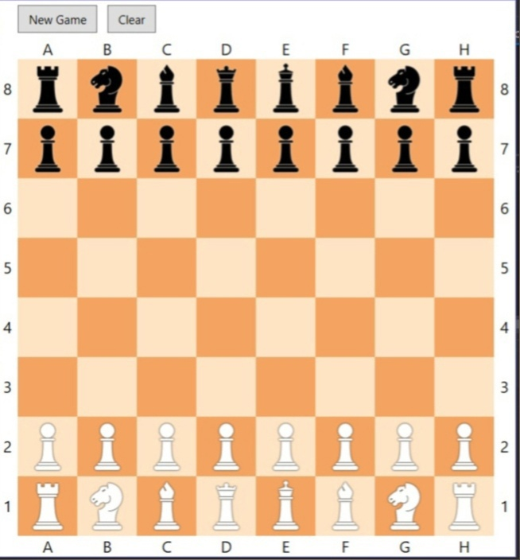
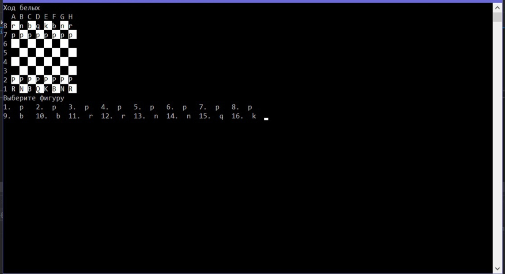

# Chess
## Описание
Простая игра Шахматы. Реализована как консольная версия, так и оконная версия игры (WPF)
### WPF

### Console

## Структура проекта
- **ChessBoard (bold)**
    - WPF проекст (MVVM)
- **ChessLib (bold)**
    - Библиотека классов. Здесь реализована логика движения фигур.
- **Chess (bold)**
    - Консольное приложение
