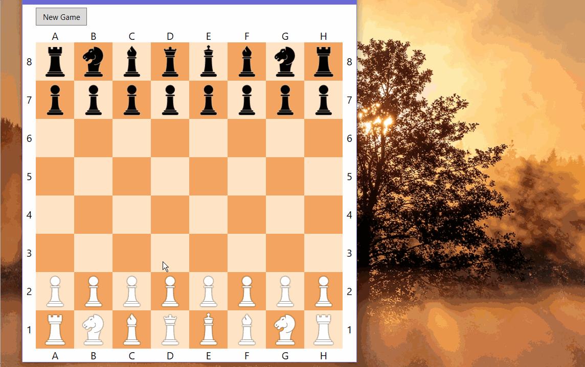
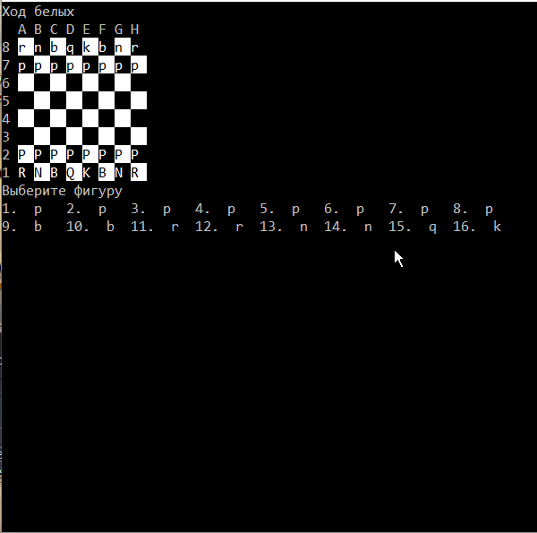

# Describtion

## Описание
Простая игра Шахматы. Реализована как консольная версия, так и оконная версия игры (WPF)

## Features

### Game Logic
- Full chess rules implementation
- All standard pieces (pawn, rook, knight, bishop, queen, king)
- Castling (short and long)
- En passant capture
- Check and checkmate detection
- Move validation
- Available moves highlighting

### Notation and Format
- FEN notation (read and write)
- Algebraic move notation
- PGN format support (import and export)
- Move history with navigation

### WPF Interface
- Modern user interface
- Chess board visualization with vector pieces
- Multiple color schemes for the board
- Custom color configuration (light and dark squares)
- Captured pieces display
- Sound effects for moves
- Side panel with tabs (Games, Historical Games, Settings, About)

### Game Management
- Save and load games
- Import historical games from PGN files
- Pagination for historical games list
- Game information display (players, date, result, move count)
- Move navigation in loaded games
- Auto-play for historical games
- Game number display in the list

### Console Interface
- Text-based interface for console play
- ASCII board visualization
- Interactive piece and move selection
### WPF

### Console

## Структура проекта
- **Chess/WPFChess**
    - WPF проект (MVVM)
- **Chess/ChessLib**
    - Библиотека классов. Здесь реализована логика движения фигур.
- **Chess/chess**
    - Консольное приложение
- **Chess/svg**
    - Ресурсы для фигур в WPF (векторные картинки)
## Как запустить код
Достаточно просто скачать репозиторий и запустить решение в Visual Studio, выбрать проект.
В **консольной версии** нужно выбрать желаемую фигуру из списка доступных (нажать ее номер на клавиатуре), затем выбрать желаемый ход из доступных.
## Модели шахматных фигур
В **WPF версии** используются модели шахматных фигур (картинки векторные), скачанные из общедоступного сайта https://www.iconfinder.com/
  
  В **Консольной версии** шахматные фигуры обозначаются буквами:
- p - Пешка (pawn)
- r - Ладья (rook)
- b - Слон (bishop)
- n - Конь (knight)
- q - Ферзь (Queen)
- k - Король (King)
  
  **Белые фигуры с большой буквы, черные - с маленькой.**
