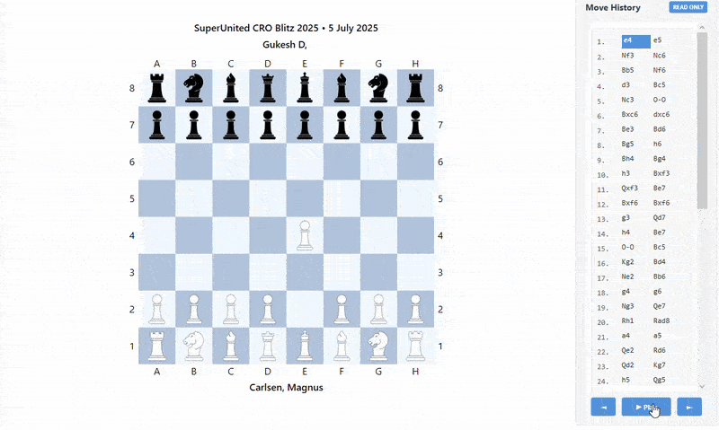
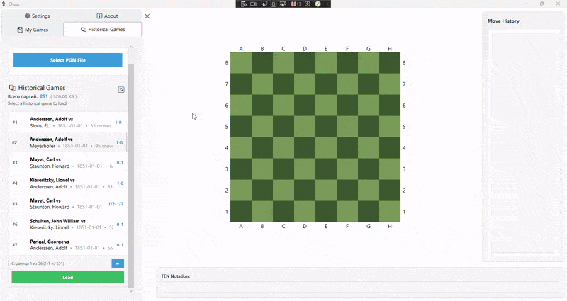
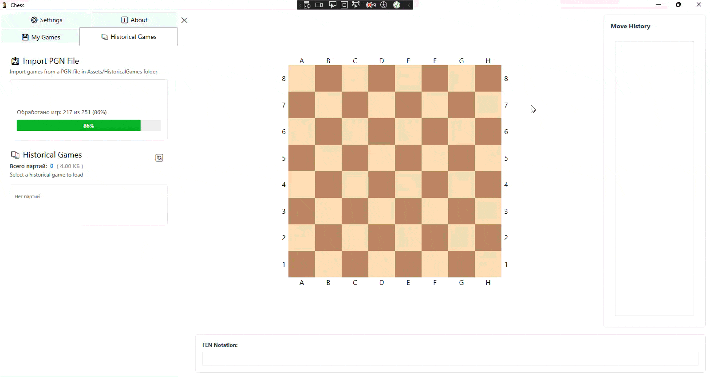
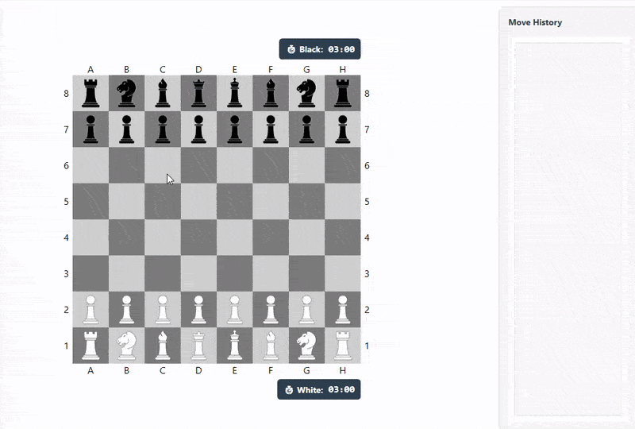
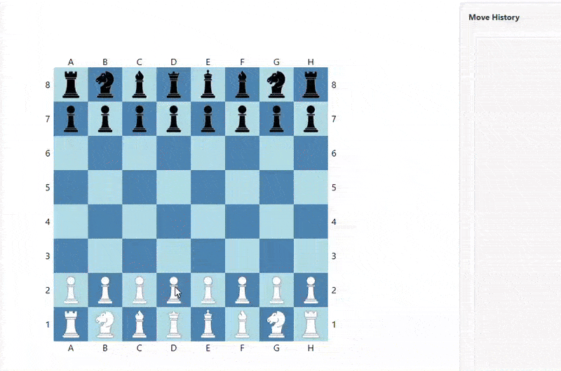

# Describtion
Classical Chess.
Supports FEN, algebraic notation, PGN games import, saving games to SQLite, autoplaying loaded games.
Clean MVVM without code-behind.
MVVM, WPF, EF Core, DI Container, SQLite

### WPF
### Autoplaying imported game

### Selecting different color themes

### Importing games

### Basic game

### Console

## Features
- Full chess rules implementation
- Available moves highlighting
- FEN notation (read and write)
- Algebraic move notation
- PGN format support (import and export)
- Move history with navigation
- Modern user interface
- Custom color configuration (light and dark squares)
- Sound effects for moves
- Save and load games
- Import historical games from PGN files
- Auto-play for historical games
- Text-based interface for console play
- ASCII board visualization
- Interactive piece and move selection
