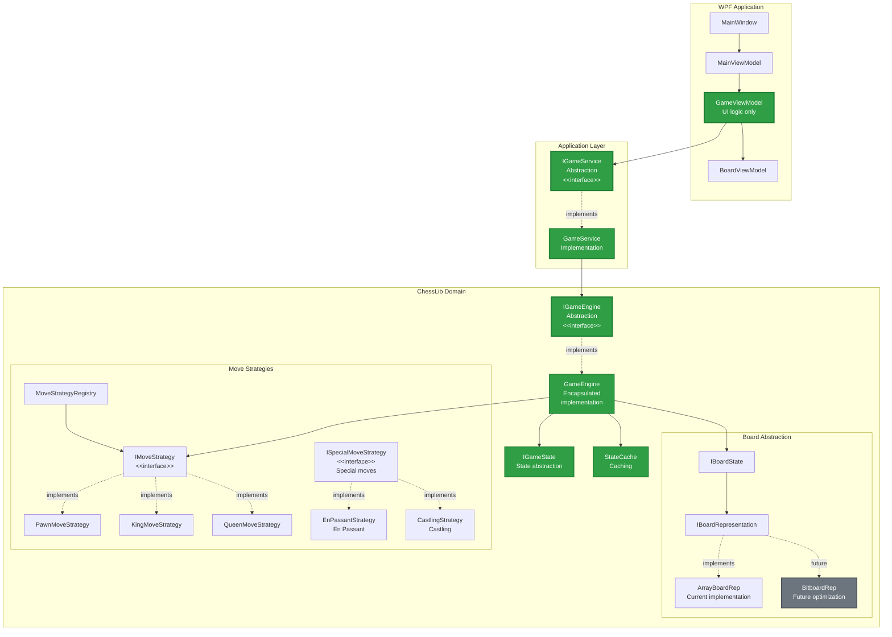

# Describtion
Classical Chess.
Supports FEN, algebraic notation, PGN games import, saving games to SQLite, autoplaying loaded games.
Clean MVVM without code-behind.
MVVM, WPF, EF Core, DI Container, SQLite

### WPF
### Autoplaying imported game


### Selecting different color themes

### Importing games

### Basic game


### Console

## Features
- Full chess rules implementation
- Available moves highlighting
- FEN notation (read and write)
- Algebraic move notation
- PGN format support (import and export)
- Move history with navigation
- Modern user interface
- Custom color configuration (light and dark squares)
- Sound effects for moves
- Save and load games
- Import historical games from PGN files
- Auto-play for historical games
- Text-based interface for console play
- ASCII board visualization
- Interactive piece and move selection

## Architecture

The application is built on clean architecture principles with clear layer separation:

### Project Structure

```
Chess/
├── ChessLib/              # Domain Layer - game logic
├── WPFChess/              # Presentation Layer - WPF application
├── ChessConsole/          # Presentation Layer - console application
└── ChessLib.Tests/        # Unit tests
```

### Architecture Layers



### Key Principles

**WPF Layer (Presentation)**:
- All ViewModels work only with UI logic
- `GameViewModel` uses `IGameService` (doesn't know about the library)
- `BoardViewModel` uses `IGameState` directly (no duplication)
- Clear separation of responsibilities between ViewModels

**Application Layer**:
- `IGameService` - single entry point for WPF
- `GameService` - simple wrapper over `IGameEngine`
- Isolation of WPF from library details

**Domain Layer (ChessLib)**:
- `IGameEngine` - main library interface
- `GameEngine` - encapsulated implementation
- `IMoveStrategy` - Strategy Pattern for all pieces
- `ISpecialMoveStrategy` - special moves (En Passant, castling)
- `IGameStateCache` - caching for performance
- `IBoardQuery` - board abstraction for strategies
- `IBoardRepresentation` - preparation for bitboards

**Architecture Benefits**:
- Full encapsulation - WPF doesn't know about library internals
- Flexibility - can change implementation without WPF changes
- Performance - caching and Strategy Pattern
- Testability - all components are isolated
- Extensibility - easy to add new strategies or board representations

> For detailed architecture analysis and refactoring plan, see [ARCHITECTURE_ANALYSIS.md](ARCHITECTURE_ANALYSIS.md)