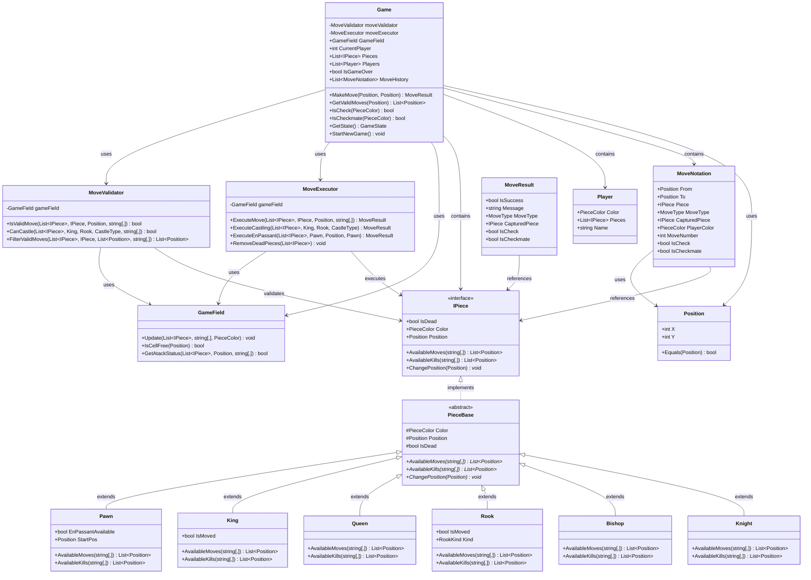
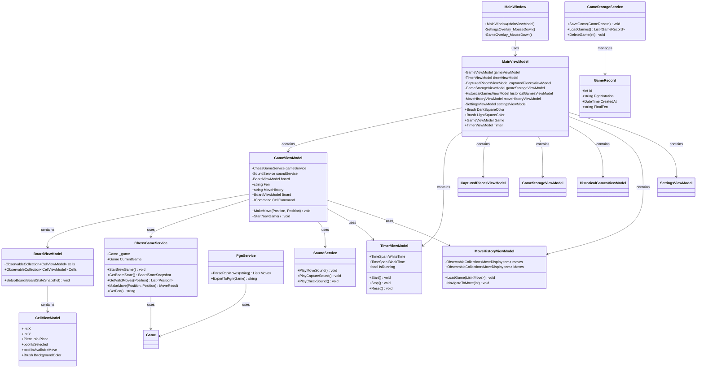
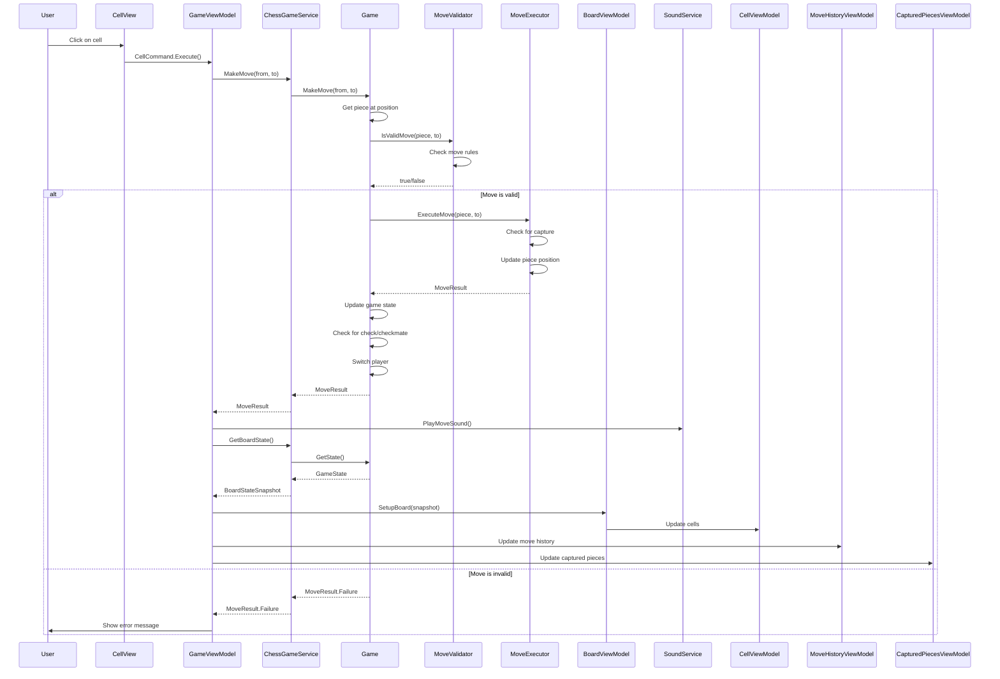
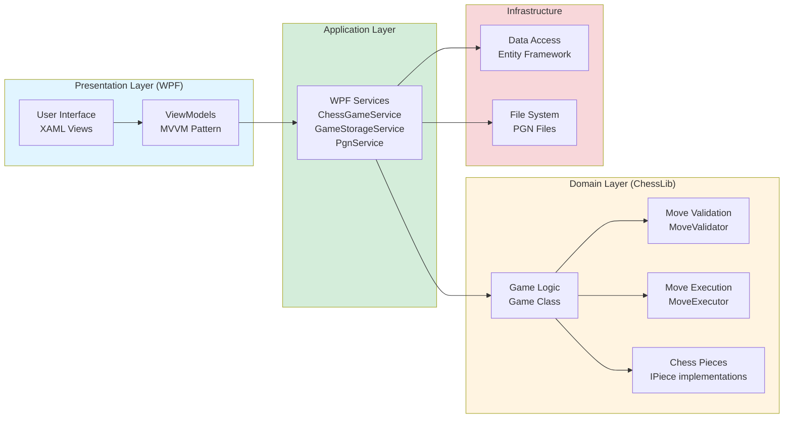

# Архитектура Chess Application

## Диаграмма архитектуры WPF и ChessLib

```mermaid
graph TB
    subgraph WPF["WPF Application Layer"]
        MW[MainWindow]
        MV[MainViewModel]
        GV[GameViewModel]
        BV[BoardViewModel]
        CV[CellViewModel]
        THV[TimerViewModel]
        CPV[CapturedPiecesViewModel]
        MHV[MoveHistoryViewModel]
        GSV[GameStorageViewModel]
        HGV[HistoricalGamesViewModel]
        SV[SettingsViewModel]
        PMV[PanelManagementViewModel]
        
        subgraph WPF_Services["WPF Services"]
            CGS[ChessGameService]
            GSS[GameStorageService]
            PGN[PgnService]
            SS[SoundService]
        end
        
        subgraph WPF_Models["WPF Models"]
            GR[GameRecord]
            HG[HistoricalGame]
            CS[ColorScheme]
            TO[TimeOption]
        end
        
        subgraph WPF_Controls["User Controls"]
            GPV[GamePlayView]
            CBV[ChessBoardView]
            GSV_UC[GameStorageView]
            HGV_UC[HistoricalGamesView]
            SV_UC[SettingsView]
        end
    end
    
    subgraph ChessLib["ChessLib Domain Layer"]
        G[Game]
        
        subgraph ChessLib_Services["ChessLib Services"]
            MV_Val[MoveValidator]
            ME[MoveExecutor]
            GF[GameField]
            FEN[Fen]
            AN[AlgebraicNotation]
            GS[GameState]
        end
        
        subgraph Pieces["Pieces"]
            IP[IPiece]
            PB[PieceBase]
            P[Pawn]
            K[King]
            Q[Queen]
            R[Rook]
            B[Bishop]
            N[Knight]
        end
        
        subgraph Common["Common Types"]
            POS[Position]
            PL[Player]
            MN[MoveNotation]
            MR[MoveResult]
            MT[MoveType]
            PC[PieceColor]
        end
    end
    
    %% WPF ViewModel connections
    MW --> MV
    MV --> GV
    MV --> THV
    MV --> CPV
    MV --> MHV
    MV --> GSV
    MV --> HGV
    MV --> SV
    MV --> PMV
    
    GV --> BV
    BV --> CV
    GV --> CGS
    GV --> SS
    GV --> MHV
    GV --> CPV
    
    %% WPF Service connections
    CGS --> G
    GSV --> GSS
    HGV --> PGN
    GSS --> GR
    HGV --> HG
    
    %% ChessLib connections
    G --> MV_Val
    G --> ME
    G --> GF
    G --> FEN
    G --> AN
    G --> GS
    G --> PL
    G --> MN
    
    MV_Val --> GF
    ME --> GF
    
    G --> IP
    IP --> PB
    PB --> P
    PB --> K
    PB --> Q
    PB --> R
    PB --> B
    PB --> N
    
    G --> POS
    G --> MR
    G --> MT
    G --> PC
    
    %% Cross-layer connections
    CGS -.->|uses| G
    CGS -.->|uses| POS
    CGS -.->|uses| IP
    GV -.->|uses| CGS
    
    style WPF fill:#e1f5ff
    style ChessLib fill:#fff4e1
    style WPF_Services fill:#d4edda
    style ChessLib_Services fill:#f8d7da
    style Pieces fill:#e7d4f8
    style Common fill:#fff9c4
```

## Диаграмма классов ChessLib

## Диаграмма классов WPF

## Диаграмма последовательности выполнения хода

## Диаграмма компонентов

